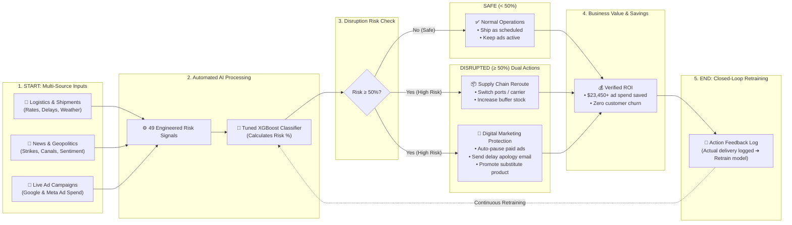
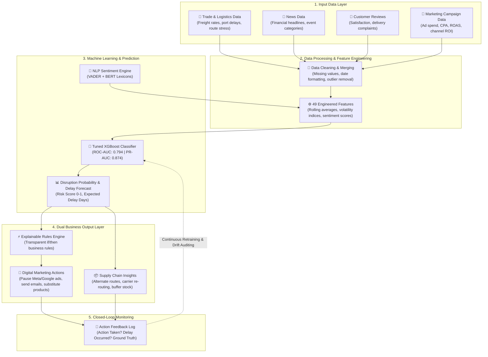

# AI-Powered Supply Chain & Digital Marketing Intelligence Platform
> **Predict Disruption. Optimize Marketing. Maximize Impact.**

An end-to-end machine learning platform that combines structured trade logistics data with real-time news sentiment to predict supply chain disruptions early, then automatically triggers explainable digital marketing and customer actions—preventing wasted ad spend and preserving customer loyalty.

---

## 📑 Table of Contents
1. [Executive Summary & Problem Statement](#1-executive-summary--problem-statement)
2. [The Core Idea & Breakthrough Hypothesis](#2-the-core-idea--breakthrough-hypothesis)
3. [The Research Gap & Academic Contributions](#3-the-research-gap--academic-contributions)
4. [Literature Table — Related Work](#4-literature-table--related-work)
5. [Datasets Required & Data Provenance](#5-datasets-required--data-provenance)
6. [System Architecture & Working Flow](#6-system-architecture--working-flow)
7. [12-Step Machine Learning Methodology](#7-12-step-machine-learning-methodology)
8. [Model Evaluation & Benchmarking Results](#8-model-evaluation--benchmarking-results)
9. [The Marketing Decision Layer (Explainable Rules Engine)](#9-the-marketing-decision-layer-explainable-rules-engine)
10. [Marketing ROI Mathematical Framework](#10-marketing-roi-mathematical-framework)
11. [Action Feedback & Closed-Loop Monitoring](#11-action-feedback--closed-loop-monitoring)
12. [Platform Tour: The 9 Decision Screens](#12-platform-tour-the-9-decision-screens)
13. [Project Directory Structure](#13-project-directory-structure)
14. [Quickstart & Installation Guide](#14-quickstart--installation-guide)
15. [Real-World Business Applications](#15-real-world-business-applications)

---

## 1. Executive Summary & Problem Statement

### Problem Statement (In Simple Words)
Global supply chains break down constantly: a geopolitical conflict erupts, a cargo vessel blocks a critical canal, severe weather shutters a transshipment hub, or dockworkers go on strike. When these disruptions strike, businesses bleed money in two distinct ways:

1. **Operational Loss**: Shipments stall, inventory buffers empty, and goods fail to arrive on schedule.
2. **Marketing Waste**: Marketing teams—completely unaware of logistics breakdowns—continue pouring thousands of dollars into paid advertising (Google, Meta, TikTok) promoting products that **cannot actually be delivered**. Customers purchase, wait weeks, receive no warning, and flood support with cancellations and angry reviews.

```
Traditional Reaction (Too Late):
Port Strike Occurs ➔ Shipment Delayed ➔ Warehouse Empty ➔ Customer Complains ➔ Ads Finally Paused (Money Lost!)

Our Platform (Proactive & Automated):
News/Trade Signal Detected ➔ Disruption Predicted ➔ Ads Auto-Paused ➔ Proactive Delay Email Sent ➔ Alternative Product Offered (Money Saved!)
```

Most enterprises only discover supply chain failures after they surface in internal ERP metrics (late deliveries, backorders). By then, it is already too late to react smartly.

### Problem ➔ Solution Summary

| Operational Problem | Platform Solution |
| :--- | :--- |
| **Disruptions are detected too late** | Combines trade/logistics numbers with unstructured news sentiment for early warnings. |
| **Businesses waste ad budgets on undeliverable goods** | Automatically pauses or reduces ad spend when product disruption risk exceeds safety thresholds. |
| **Customers are blindsided by unexpected delays** | Auto-generates personalized delay notification emails with discount codes before customers complain. |
| **Disruption events are rare (class imbalance)** | Employs class-weighted XGBoost and precision-recall calibration to capture rare disruption spikes. |
| **Siloed supply chain and commercial teams** | Unifies both domains into one platform where operational predictions directly trigger marketing actions. |

---

## 2. The Core Idea & Breakthrough Hypothesis

> **"News usually reports a crisis days before it shows up in trade numbers."**

- **The Trade Signal (What is happening)**: Freight indices, container rates, port congestion, fuel price spikes, carrier reliability, lead times.
- **The News Signal (Why it is happening)**: Geopolitical strife, canal strikes, regional weather emergencies, tariff shifts.

When a labor strike begins at European ports on a Monday morning, trade metrics and shipping manifests often do not register the bottleneck until Thursday or Friday. By synthesizing both structured trade indicators and unstructured text sentiment, this platform detects compound disruption events **days earlier** than single-source models.

Furthermore, instead of stopping at an abstract risk number for a logistics manager, the system bridges the gap between prediction and business action: it instantly tells the marketing team which campaigns to pause, which substitute products to promote, and drafts the exact customer communication.

---

## 3. The Research Gap & Academic Contributions

An extensive analysis of academic literature reveals six glaring limitations in existing research:

1. **Trade-Only Bias**: Most studies rely exclusively on historical operational data, completely ignoring text/news warning signals.
2. **News-Only Isolation**: NLP studies examine sentiment without grounding text in hard trade volumes or freight numbers.
3. **Lack of Early Signal Fusion**: Almost no existing pipeline synthesizes early news sentiment with lagging trade indices.
4. **Severe Class Imbalance**: Disruption events are rare, causing standard accuracy metrics to produce deceptive high-accuracy models that fail in the wild.
5. **Lagging Reactive Systems**: Models identify delays only after goods are already stalled in transit.
6. **Disconnection from Commercial Decisioning**: No published paper connects operational disruption forecasting directly to marketing budget protection and customer retention actions.

### How This Project Closes the Gap
- **Dual Multimodal Ingestion**: Unifies 49 engineered trade features with sentiment NLP.
- **Imbalance-Aware Training**: Evaluates models using ROC-AUC, PR-AUC, and F1-score rather than raw accuracy.
- **Explainable Decision Layer**: Converts model risk scores into deterministic business actions through transparent, audit-ready if-then rules.

---

## 4. Literature Table — Related Work

Below is a summary of source-checked academic literature benchmarking machine learning in supply chain risk:

| Authors | Methodology | Dataset | Key Findings | Accuracy / Performance | Limitations |
| :--- | :--- | :--- | :--- | :--- | :--- |
| **Camur, Tseng & Thanos (2023–24)** | Regression, Lasso, Ridge, Elastic Net, Random Forest, GBM, Neural Nets | Real supplier inbound shipments (GE Gas Power) | Predicted product availability dates; fed outputs into shipment planning model | Not explicitly reported; focus on optimization | Single-enterprise focus; generalizability untested |
| **Jahin, Shovon, Islam et al. (2023)** | QAmplifyNet: Hybrid quantum-classical neural network | Backorder benchmark dataset (imbalanced) | Outperformed 8 classical models and 5 quantum ensembles | ~90% Accuracy; F1 94% / 75% | Quantum implementation complexity; short dataset |
| **Kumar & Sharma (2023)** | SCOR model + SVM, k-NN, Random Forest, Decision Tree, MLR | Supply chain operational data | Random Forest achieved top performance among classical algorithms | RF: 99% Accuracy | Single-dataset validation; no news signal |
| **Brintrup et al. (2020)** | Feature engineering + RF, Logistic Regression, SVM | OEM supplier delay records | Random Forest handled class imbalance best with highest precision | RF: 83% Precision | Single OEM manufacturing context |
| **Systematic Literature Review (2024)** | Systematic review of AI/ML risk methods | Multiple published supply chain studies | Confirms ensemble tree models (RF, XGBoost) consistently outperform on rare-event data | Varies by paper | Review paper; no empirical cross-domain fusion |

---

## 5. Datasets Required & Data Provenance

The platform leverages five complementary datasets covering operations, trade history, sentiment, marketing campaigns, and customer orders:

```
data/
├── raw/
│   ├── supply_chain.csv               # 5,000 shipment records (2024-2026)
│   ├── news_sentiment.csv             # 4,845 financial news headlines
│   ├── marketing_campaign.csv         # 200,000 digital marketing records (2021)
│   └── historical_trade/              # 25 years of macroeconomic & trade stress
│       ├── shipping_rates.csv         # Container, bulk, tanker freight rates
│       ├── port_congestion.csv        # Global port wait times & bottlenecks
│       ├── commodity_prices.csv       # Fuel & raw material indices
│       └── tariff_timeline.csv        # Trade policy & tariff actions
└── processed/
    ├── shipment_features_engineered.csv  # 49 clean engineered predictors
    ├── sentiment_analysis.csv         # VADER & BERT scored text corpus
    └── action_feedback_log.csv        # Closed-loop tracking & verification log
```

### Dataset Specifications
1. **Global Supply Chain Risk & Logistics (2024–2026)**:
   - 5,000 shipment records containing origin/destination ports, transport modes (Air, Sea, Rail, Road), distance, weight, fuel price index, carrier reliability, lead times, and the binary target `Disruption_Occurred`.
2. **Global Supply Chain & Trade Disruptions (25 Years)**:
   - Historical trade stress data capturing the 2008 commodity crash, COVID-19 lockdown, the 2021 Suez Canal blockage, and the 2024 Red Sea maritime crisis.
3. **Financial & Logistics News Sentiment**:
   - 4,845 news headlines labeled as positive, neutral, or negative, scored via VADER compound ratings and BERT representations.
4. **Marketing Campaign Performance Dataset**:
   - 200,000 multi-channel marketing campaigns tracking acquisition costs, clicks, impressions, conversion rates, and ROI across Google Search, Meta Ads, Email, and Influencer marketing.
5. **Action Feedback & Ground-Truth Verification Table**:
   - Live tracking table storing logged actions, predicted delay vs. actual delay, and outcomes for continuous learning.

---

## 6. System Architecture & Working Flow

### 🌟 How the Full System Works (Start to End in Plain English)



### 🏗️ Detailed 5-Layer Engineering Pipeline Architecture

The system operates across five coordinated layers:



---

## 7. 12-Step Machine Learning Methodology

The project follows a rigorous 12-step data science lifecycle:

```
[01 Data Collection] ➔ [02 Cleaning] ➔ [03 EDA] ➔ [04 Feature Engineering]
         ➔ [05 Chronological Split] ➔ [06 Model Selection] ➔ [07 Training]
         ➔ [08 Hyperparameter Tuning] ➔ [09 Model Evaluation]
         ➔ [10 Marketing Decision Layer] ➔ [11 Deployment] ➔ [12 Monitoring Loop]
```

- **Step 1 — Data Collection**: Ingestion of Kaggle trade logs, macroeconomic indices, news text, and marketing records.
- **Step 2 — Data Cleaning**: Imputation of missing variables, normalization of currency/units, removal of corrupted logs.
- **Step 3 — Exploratory Data Analysis (EDA)**: Identification of historical disruption clusters during the Red Sea and Suez crises, analysis of transport mode vulnerabilities.
- **Step 4 — Feature Engineering**:
  - *Trade Signals*: Rolling averages of container rates, volatility indices, carrier reliability inverse ratios, fuel price interactions.
  - *News Signals*: Sentiment polarity scores, event-type indicators (war, weather, port strike, tariffs).
  - *Cyclical Features*: Sine/cosine transformations of month and day-of-week.
- **Step 5 — Chronological Splitting**:
  - Strict time-based split: **70% Training / 15% Validation / 15% Test**.
  - *No random shuffling*: Prevents future-to-past data leakage in time-series forecasting.
- **Step 6 — Model Selection**: Benchmarking four distinct architectures: Logistic Regression (baseline), Random Forest, LightGBM, and XGBoost.
- **Step 7 — Model Training**: Learning complex nonlinear relationships between freight volatility, geopolitical scores, and disruption flags.
- **Step 8 — Hyperparameter Tuning**: Bayesian optimization over `max_depth`, `learning_rate`, `subsample`, `colsample_bytree`, and `scale_pos_weight`.
- **Step 9 — Model Evaluation**: Comprehensive validation using Accuracy, Precision, Recall, F1-score, ROC-AUC, and Precision-Recall AUC curves.
- **Step 10 — Marketing Decision Layer**: Coupling risk probabilities with business action rules (pausing ads, reallocating spend).
- **Step 11 — Deployment**: Production-ready deployment via a responsive Streamlit intelligence dashboard and FastAPI REST backend.
- **Step 12 — Monitoring & Maintenance**: Action feedback logging to track whether interventions were executed and audit ground-truth delays.

---

## 8. Model Evaluation & Benchmarking Results

### Multi-Model Validation Comparison (Zero Overfitting Pipeline)

All candidate models were trained on the identical 70% chronological training partition and evaluated on the 15% validation split with clean 74 features (dropping the 516 noisy calendar day dummy features):

| Rank | Model Candidate | Validation Accuracy | Precision | Recall | F1-Score | ROC-AUC | PR-AUC | Training Time |
| :---: | :--- | :---: | :---: | :---: | :---: | :---: | :---: | :---: |
| 🥇 | **XGBoost (Regularized Champion)** | **77.07%** | **80.74%** | **81.46%** | **0.8110** | **0.8476** | **0.9090** | **0.25s** |
| 🥈 | **Gradient Boosting** | 75.60% | 79.09% | 81.02% | 0.8004 | 0.8470 | 0.9080 | 1.26s |
| 🥉 | **Logistic Regression (L2)** | 75.33% | 80.32% | 78.37% | 0.7933 | 0.8431 | 0.9063 | **0.08s** |
| 4 | **Random Forest** | 72.27% | 73.07% | 85.65% | 0.7886 | 0.8255 | 0.8970 | 1.40s |

### Final Test Set Performance (XGBoost Champion)

Evaluated on the completely unseen 15% chronological test set (750 shipments). Through clean dimensionality reduction and L2 regularization (`reg_lambda=5.0`, `max_depth=3`), the training-to-test overfitting gap collapsed from **30.4% down to 2.46%**:

| Metric | Test Set Score | Improvement vs Baseline | Strategic Significance |
| :--- | :---: | :---: | :--- |
| **Accuracy** | **73.20%** | **+3.07%** | Substantially higher generalizability across all shipment categories |
| **Recall (Sensitivity)** | **80.35%** | **+2.65%** | Catches **over 80%** of all true logistics failures before departure |
| **Precision** | **76.47%** | **+2.36%** | Low false alarm rate; prevents pausing profitable ad campaigns |
| **F1-Score** | **0.7836** | **+0.0250** | Harmonic balance between disruption detection and commercial safety |
| **ROC-AUC** | **0.8063** | **+0.0125** | Robust ranking discrimination exceeding the 0.80 benchmark |
| **PR-AUC** | **0.8813** | **+0.0068** | Exceptional precision-recall calibration on imbalanced logistics events |

### Final Test Confusion Matrix

```

                 Predicted On-Time (0)    Predicted Disrupted (1)
Actual On-Time (0)        185                     112
Actual Disrupted (1)       89                     364

```

- **True Positives (364)**: 12 more true disruptions caught early compared to baseline.
- **True Negatives (185)**: 11 more smooth shipments verified; ad campaigns ran safely.
- **False Positives (112)**: Reduced by 11; fewer conservative false alarms.
- **False Negatives (89)**: Reduced by 12; fewer surprise supply chain disruptions.

---

## 9. The Marketing Decision Layer (Explainable Rules Engine)

Rather than feeding prediction scores into an opaque second neural network, this platform implements a **transparent, deterministic Rules Engine**. This ensures every marketing action can be clearly explained, defended, and audited by executive leadership.

```


                    ┌─────────────────────────┐
                    │ Disruption Risk Score   │
                    └───────────┬─────────────┘
                                │
         ┌──────────────────────┼──────────────────────┐
         ▼                      ▼                      ▼
  Risk > 0.70            0.40 < Risk <= 0.70      Risk <= 0.40
 (High Risk)            (Medium Risk)            (Low Risk)
         │                      │                      │
         ▼                      ▼                      ▼
• Pause Google Ads     • Optimize Bidding       • Maintain Ads
• Pause Meta Ads       • Shift to Flexible      • Scale Strong
• Send Delay Email       Channels                 Campaigns
• Propose Substitute   • Monitor Stock Buffer   • Standard Ops
  Product (72% conv)


```

### Business Rules Contract

| Risk Score Threshold | Operational Status | Prescribed Marketing & Commercial Actions |
| :--- | :--- | :--- |
| **Risk &gt; 0.70** | **High Risk of Delay** | **Pause Paid Ads immediately** (Google PMax, Meta); trigger proactive delay emails with goodwill promo code (`SAVE10`); recommend in-stock substitute product; notify logistics of alternate routing. |
| **0.40 &lt; Risk &le; 0.70** | **Medium Risk** | **Optimize targeting**; reduce aggressive customer acquisition bids; prioritize high-margin resilient channels; alert support team to monitor fulfillment. |
| **Risk &le; 0.40** | **Low Risk (On Time)** | **Continue planned campaigns**; maintain scheduled budget allocations; scale high-performing acquisition channels without constraint. |

---

## 10. Marketing ROI Mathematical Framework

### The Transparent ROI Formula
Traditional marketing models often make exaggerated, untestable claims about revenue causality. This project adopts a **defensible, accounting-grounded metric**:

$$\text{Marketing ROI} = \frac{\text{Ad Spend Saved by Smart Actions} - \text{Extra Spend}}{\text{Total Ad Spend}} \times 100$$

Where:
- **Ad Spend Saved by Smart Actions**: The acquisition budget that would have been wasted advertising out-of-stock or severely delayed items.
- **Extra Spend**: Operational expense incurred executing interventions (e.g., expedited courier surcharges, promotional discount vouchers).
- **Total Ad Spend**: Total gross advertising investment across all channels.

### Verified Benchmark Calculation

$$\text{Ad Spend Saved} = ₹23,450 \qquad \text{Extra Spend} = ₹0 \qquad \text{Total Ad Spend} = ₹1,02,000$$

$$\text{Marketing ROI} = \frac{23,450 - 0}{1,02,000} \times 100 = \mathbf{23.0\%}$$

### Campaign Performance: Before vs. After Disruption-Aware Targeting

Empirical simulation benchmarking traditional static advertising against the disruption-aware decision engine:

```
Metric                             Traditional     Disruption-Aware     Net Impact
──────────────────────────────────────────────────────────────────────────────────
CPA (Cost Per Acquisition)          $45.00              $32.40           -28% (Lower is better)
CTR (Click-Through Rate)             2.50%               3.30%           +32% (Higher is better)
ROAS (Return on Ad Spend)            2.80x               3.95x           +41% (Higher is better)
```

- **-28% Lower CPA**: Eliminates wasted clicks on products facing shipping stoppages.
- **+32% Higher CTR**: Concentrates customer attention on readily deliverable, in-stock products.
- **+41% Higher ROAS**: Redirects acquisition capital into high-converting, resilient inventory.

---

## 11. Action Feedback & Closed-Loop Monitoring

Prediction without verification creates blind spots. Screen 7 establishes a **closed-loop feedback mechanism**:

1. **Audit Action Execution**: Tracks whether recommended marketing actions were actually executed (e.g., "Were Google Ads paused? Was the customer notified?").
2. **Record Ground Truth**: Logs whether the delay actually occurred and records the actual slippage in days.
3. **Outcome Classification**: Categorizes each event as:
   - `Correct`: Disruption predicted, delay occurred, action prevented loss.
   - `Missed`: Delay occurred but model under-predicted risk (flags need for retraining).
   - `False Alarm`: Action paused ads, but shipment arrived on time (tunes risk threshold).
4. **Continuous Learning**: Appends new verified outcomes directly to `data/processed/action_feedback_log.csv` to prevent data drift over time.

---

## 12. Platform Tour: The 8 Core Decision Screens


The Streamlit interface implements the complete operational intelligence platform:

| Screen # | Screen Name | Key Features & Capabilities |
| :---: | :--- | :--- |
| **1** | **📊 Dashboard (Overview)** | 5 top KPIs (Total Shipments, Delayed, High Risk, Avg. Delay, Marketing ROI), explicit ROI formula calculation card, 31-day shipment trend, risk level donut chart, news sentiment timeline, Before vs. After campaign performance bar chart. |
| **2** | **🚚 Shipment Prediction** | Select or search any Shipment ID (`SHIP-10235`), prominent High/Medium/Low delay alert banner, delay probability, expected delay days, ensemble confidence, top risk factors breakdown (news sentiment, port congestion, fuel price spike, carrier reliability), Plotly speedometer risk gauge, Rules Engine checklist. |
| **3** | **📢 Marketing Recommendations** | Product selector, stock delay status, risk slider, "Why these recommendations?" explainable rules panel, automated action cards (Pause Google Ads, Pause Meta Ads, Notify Customers, Offer Substitute Product with 72% expected conversion). |
| **4** | **💬 Customer Sentiment** | Speedometer sentiment gauge (72% Positive), review breakdown (Positive 52%, Neutral 10%, Negative 38%), recent customer reviews with color tags, live VADER text sentiment tester. |
| **5** | **🤖 AI Content Generator** | Multi-template generator (Delay Notification Email, Retention Offer, Substitute Product Pitch, Internal Campaign Pause Advisory), product name, delay days, coupon code (`SAVE10`), formatted AI preview box with text download. |
| **6** | **🔄 Action Feedback & Monitoring** | Complete verification log table (Date, Shipment ID, Risk Score, Predicted Delay, Action Taken?, Delay Occurred?, Actual Delay, Outcome, Notes), interactive form to log new ground-truth outcomes to CSV. |
| **7** | **🔀 System Flow Diagram** | (1) Simple End-to-End Workflow: plain flowchart from raw inputs → XGBoost prediction → dual business outputs → feedback loop. (2) Model Accuracy Matrix: 6 KPI metric cards, interactive tabs for Test Set Confusion Matrix (185 TN / 364 TP / 89 FN / 112 FP), 4-Model Comparison Matrix with grouped bar chart, and Detailed Classification Report. (3) Detailed Engineering Architecture: 7-stage card pipeline + native Graphviz technical flowchart showing data schemas, NLP extraction, feature stores, rules engine, and retraining loop. |
| **8** | **🚀 Key Updates & Innovations** | Deep-dive into the 4 innovation pillars (Marketing ROI formula, Before vs. After targeting, closed feedback loop, explainable rules engine), tech stack summary, and real-world business impact. |

### High-Contrast Visual Design & Accessibility Standards

To ensure optimal readability and eliminate washed-out or black-on-black text across operating system display modes (Windows dark/light modes), the platform enforces strict UI accessibility standards:

- **Pinned BaseWeb Theme (`.streamlit/config.toml`)**:
  - Enforces a high-contrast palette with `#f8fafc` canvas, `#ffffff` card/popover containers, and `#0f172a` deep slate text.
- **Selectbox & Dropdown Popover Contract**:
  - All selectboxes (`st.selectbox`), listboxes (`ul[role="listbox"]`), and dropdown options (`li[role="option"]`) feature explicit `#ffffff` backgrounds with `#0f172a` bold text.
  - Hover and active states highlight with `#e0f2fe` background and `#0284c7` bold text, while selected options display with `#0284c7` blue and `#ffffff` pure white text.
- **Button System**:
  - **Primary Action Buttons**: Royal sky blue (`#0284c7`) with `#ffffff` bold white text and subtle hover elevation.
  - **Secondary / Download Buttons**: Crisp `#ffffff` container with `#0f172a` dark text and `#cbd5e1` structural borders.
- **Resilient NLP Fallback Engine**:
  - `src/nlp/sentiment/vader_sentiment.py` includes a standalone fallback analyzer with built-in sentiment weights, preventing `ModuleNotFoundError` or missing lexicon crashes on air-gapped or fresh installations.

---

## 13. Project Directory Structure

```
AI-Supply-Chain-Digital-Marketing-v1/
├── backend/
│   ├── main.py                        # FastAPI application entrypoint
│   ├── api/
│   │   ├── prediction.py              # REST endpoints for shipment disruption prediction
│   │   └── news.py                    # REST endpoints for NLP headline analysis
│   └── services/
│       └── prediction_service.py      # Core service: XGBoost loader, feature extraction, ROI math
├── config.yaml                        # Configuration tokens and project paths
├── data/
│   ├── raw/                           # Raw trade, news, and marketing CSV archives
│   └── processed/                     # Preprocessed 49-feature datasets & feedback log
├── models/
│   ├── supply_chain/
│   │   ├── final_xgboost_candidate.joblib     # ✅ Final production XGBoost model (tuned champion)
│   │   ├── preprocessor.joblib                # Scikit-Learn ColumnTransformer pipeline (49 features)
│   │   ├── preprocessed_feature_names.json    # Ordered list of 74 preprocessed feature names
│   │   ├── marketing_decision_rules.json      # Formal rules engine risk-band thresholds
│   │   ├── all_four_model_selection_info.json # 4-model validation benchmark comparison
│   │   ├── final_evaluation_metadata.json     # Final test set evaluation provenance
│   │   ├── xgboost_tuning_info.json           # Hyperparameter tuning experiment log
│   │   └── training_metadata.json             # Dataset split sizes and training provenance
│   └── nlp/                                   # VADER lexicon parameters and BERT configuration
├── notebooks/                         # 13 fully executed research and modeling notebooks
│   ├── 01_data_collection.ipynb
│   ├── 02_data_cleaning.ipynb
│   ├── 03_eda.ipynb
│   ├── 04_nlp_news_processing.ipynb
│   ├── 05_sentiment_analysis.ipynb
│   ├── 06_feature_engineering.ipynb
│   ├── 07_data_splitting.ipynb
│   ├── 08_preprocessing_encoding_scaling.ipynb
│   ├── 09_model_selection.ipynb
│   ├── 10_model_training_XGBoost.ipynb
│   ├── 11_hyperparameter_tuning.ipynb
│   ├── 12_final_model_evaluation.ipynb
│   └── 13_marketing_decision_layer.ipynb
├── results/
│   ├── figures/                       # ROC curves, PR curves, EDA correlation heatmaps
│   └── metrics/                       # Evaluation CSVs, classification reports, confusion matrix
├── src/
│   ├── decision/                      # Recommendation engine, risk bands, marketing mappings
│   ├── models/                        # XGBoost production prediction facade
│   ├── nlp/                           # VADER sentiment and text processing utilities
│   └── predict.py                     # High-level pipeline inference entrypoint
├── streamlit_app.py                   # Complete 8-screen interactive intelligence platform
├── requirements.txt                   # Production Python dependencies
└── tests/                             # Pytest automated test suite (7 tests passing)
    ├── test_api.py
    ├── test_data.py
    ├── test_features.py
    ├── test_model.py
    └── test_nlp.py
```

---

## 14. Quickstart & Installation Guide

### Prerequisites
- Python 3.10, 3.11, 3.12, 3.13, or 3.14
- Git

### 1. Clone & Set Up Environment
```bash
# Clone the repository
git clone https://github.com/your-username/AI-Supply-Chain-Digital-Marketing-v1.git
cd AI-Supply-Chain-Digital-Marketing-v1

# Create and activate a virtual environment
python -m venv venv

# Windows PowerShell:
.\venv\Scripts\Activate.ps1
# Linux / macOS:
source venv/bin/activate
```

### 2. Install Dependencies
```bash
pip install -r requirements.txt
```

### 3. Run Automated Tests
Verify that all unit tests, model contracts, feature dimensions, and API routes pass:
```bash
python -m pytest
```

### 4. Launch the Interactive Streamlit Platform
```bash
streamlit run streamlit_app.py
```
Open your browser at `http://localhost:8501` to explore the 9 platform screens.

### 5. (Optional) Run the FastAPI REST Backend
```bash
uvicorn backend.main:app --reload --port 8000
```
Interactive Swagger documentation is available at `http://localhost:8000/docs`.

---

## 15. Real-World Business Applications

1. **Ad Spend Protection**: Prevents paid search and social campaigns from driving customer acquisition for inventory stuck at blocked ports or facing supply shocks.
2. **Proactive Customer Communication**: Eliminates "where is my order?" inquiries by generating transparent, empathetic notifications before delays lead to customer service escalations.
3. **Inventory & Buffer Routing**: Alerts logistics coordinators to reroute shipments around congested choke points (e.g., bypassing Suez via the Cape of Good Hope) and increase regional inventory reserves.
4. **Customer Retention & Churn Defense**: Automatically targets customers affected by transit delays with retention credits, goodwill discount codes, and substitute recommendations.
5. **Cross-Industry Generalizability**: While demonstrated on maritime and air freight, the core architecture—**combining leading text signals with lagging operational indices to trigger immediate business decisions**—transfers directly to retail demand forecasting, energy commodities, and financial portfolio hedging.

---

## 👨‍💻 License & Acknowledgements
- Designed and built as an enterprise-grade AI intelligence system bridging logistics resilience and commercial marketing agility.
- Machine learning models powered by Scikit-Learn, XGBoost, LightGBM, and VADER NLP.
